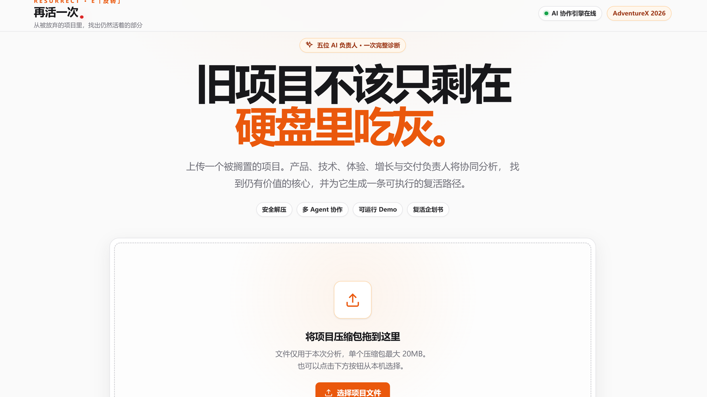
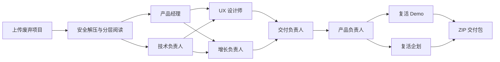

<div align="center">

<p><code>RESURRECT · COLLABORATIVE RECOVERY</code></p>


# 🔥 再活一次

### 把被放弃的数字项目，复活成一个能演示、能交付、能继续生长的新产品。

上传项目压缩包。让一支 AI 产品团队读懂遗留代码、寻找仍在跳动的价值，最后交付一个可运行的复活 Demo 与完整企划。

<p>
  
  
  
  
</p>

<p>
  <a href="#-快速开始">快速开始</a> ·
  <a href="#-它如何工作">工作流</a> ·
  <a href="#-核心能力">核心能力</a> ·
  <a href="#-配置">配置</a> ·
  <a href="#-安全边界">安全边界</a>
</p>

<sub>AdventureX 2026 · 主题 E「反转」</sub>

</div>

---
<p align="center"></p>

## 为什么是「再活一次」？

很多项目并不是毫无价值，只是死在了错误的范围、模糊的用户、未完成的体验，或一次来不及收尾的交付里。

「再活一次」不会简单地替旧项目写一份总结。它会组织一支有明确岗位、存在前后依赖的 AI 产品团队，从代码和项目材料中寻找证据，选择唯一的复活点，并把它推进到可以亲手体验的 Demo。

> **输入：** `.zip` / `.tar` / `.tar.gz` / `.tgz` / `.7z` / `.rar` 项目包<br>
> **输出：** 产品诊断、岗位结论、唯一复活方向、可运行 Demo、复活企划与可下载交付包

## ✨ 核心能力

- **项目级阅读** — 识别目录、语言、框架、关键文件、TODO、死亡信号与最近修改线索。
- **5+1 岗位协作** — 产品、技术、UX、增长与交付负责人分阶段工作，最后由产品负责人决策。
- **证据驱动** — 每份岗位结论都携带项目文件、原始片段与候选方向，而不是凭空生成。
- **实时协作图** — 通过 SSE 展示负责人状态、分析节点、可见工作过程与最终结论。
- **唯一复活点** — 综合用户价值、技术可行性、体验辨识度、增长空间和交付成本做单点决策。
- **一键交付** — 生成自包含 HTML Demo、复活企划、结构化 JSON 与可下载 ZIP 礼包。
- **皮肤预览** — 在结果页切换视觉皮肤，并将所选样式烘焙进下载产物。

## 🧠 它如何工作



| 岗位 | 关注的问题 | 交付物 |
| --- | --- | --- |
| 产品经理 | 谁真正需要它？最小价值是什么？ | 用户问题与 MVP 方向 |
| 技术负责人 | 哪些资产还能复用？边界和技术债在哪里？ | 技术资产、风险与实现边界 |
| UX 设计师 | 用户如何完成核心任务？哪一刻最有辨识度？ | 核心流程与一屏体验 |
| 增长负责人 | 第一批用户是谁？从哪里找到他们？ | 定位、价值主张与获客切口 |
| 交付负责人 | 短周期内到底能交付什么？ | 范围、依赖、风险与舍弃项 |
| 产品负责人 | 五份意见最终指向哪里？ | 唯一、可演示、可交付的复活方向 |

## 🚀 快速开始

### 环境要求

- JDK **21**
- Maven **3.9.9**（仓库中的 Wrapper 配置指定该版本）
- 一个可用的 DeepSeek API Key

> 仓库目前包含 `.mvn/wrapper/maven-wrapper.properties`，但未提交 `mvnw` / `mvnw.cmd` 启动脚本，因此请确保本机 Maven 版本为 3.9.9。

### 1. 克隆项目

```bash
git clone https://github.com/RonXln/resurgence.git
cd resurgence/advx
```

### 2. 配置模型

Windows PowerShell：

```powershell
$env:DEEPSEEK_API_KEY = "<your-api-key>"
$env:DEEPSEEK_MODEL = "deepseek-v4-flash"
```

macOS / Linux：

```bash
export DEEPSEEK_API_KEY="<your-api-key>"
export DEEPSEEK_MODEL="deepseek-v4-flash"
```

模型名称以你的 DeepSeek 账户当前支持列表为准。未配置 API Key 时，服务会进入 mock/降级路径，适合检查界面，但不代表真实模型调用。

### 3. 启动

```bash
mvn spring-boot:run
```

打开 [http://localhost:8000](http://localhost:8000)，上传一个项目压缩包，观看这支 AI 产品团队开始工作。

## 📦 交付包里有什么？

任务完成后，可以从结果页下载一个独立 ZIP：

```text
resurrected-project.zip
├── index.html   # 可直接打开的自包含 Demo
├── README.md    # 产品墓志铭、复活点、卖点与企划
├── plan.json    # 决策、岗位意见与项目证据
└── heart.txt    # 从旧项目中找到的“仍在跳动的心脏”
```

`index.html` 默认包含本地模拟 API 与浏览器持久化，用来构成可离线演示的产品闭环；它不是生产后端，也不会代表真实业务接口已经完成。

## ⚙️ 配置

主要配置位于 [`advx/src/main/resources/application.yml`](advx/src/main/resources/application.yml)：

| 环境变量 | 默认值 | 说明 |
| --- | --- | --- |
| `DEEPSEEK_API_KEY` | 空 | DeepSeek API Key；为空时返回 mock 响应 |
| `DEEPSEEK_BASE_URL` | `https://api.deepseek.com` | OpenAI 兼容 API 地址 |
| `DEEPSEEK_MODEL` | `deepseek-chat` | 模型名；建议显式设置为账户当前支持的模型 |
| `IMAGE_API_KEY` | 空 | 可选生图服务 Key |
| `IMAGE_BASE_URL` | `https://api.siliconflow.cn/v1` | 可选生图服务地址 |
| `IMAGE_MODEL` | `black-forest-labs/FLUX.1-schnell` | 可选生图模型 |

默认上传限制：单个压缩包 **20 MB**、最多读取 **5000** 个文件、文本读取预算 **5 MB**。可在 `resurrect.upload` 下调整。

## 🏗️ 技术架构

```text
Browser · HTML / Tailwind / Alpine.js
        │ upload · SSE · result · demo · download
        ▼
Spring Boot 3.3.4
        ├── ArchiveExtractor     安全解压
        ├── ProjectReader        项目分层阅读
        ├── AgentOrchestrator    5+1 岗位 DAG 编排
        ├── DeepSeekClient       OpenAI 兼容模型调用
        ├── HtmlGenerator        自包含 Demo 生成
        ├── PitchGenerator       复活企划生成
        ├── SkinService          Demo 皮肤注入
        └── ResurrectionBundler  ZIP 交付打包
```

### 关键目录

```text
advx/src/main/
├── java/com/advx/resurrect/
│   ├── agent/       # 5 位分析负责人 + 产品负责人
│   ├── controller/  # 上传、SSE、结果、Demo、下载 API
│   ├── model/       # 任务、意见、方案与企划模型
│   ├── service/     # 阅读、编排、生成与打包
│   └── store/       # 内存任务状态与 SSE 历史
└── resources/
    ├── application.yml
    └── static/      # 上传页、协作进度页与结果页
```

## 🛡️ 安全边界

- 解压路径经过规范化检查，阻止 Zip Slip 跳出任务目录。
- 解压文件数和总体积受限，用于降低 Zip Bomb 风险。
- 二进制文件、构建产物、依赖目录与版本控制目录不会进入项目文本分析。
- API Key 只应通过环境变量提供；不要提交到仓库或写进压缩包。
- 当前任务状态存储在进程内存中，服务重启后不会保留历史任务。
- AI 输出和离线 Demo 仅适合原型验证，上线前仍需进行人工评审、安全测试与真实后端集成。

## 🧪 验证

```bash
mvn test
```

只做快速编译检查：

```bash
mvn -DskipTests compile
```

## 🤝 参与开发

欢迎提交 Issue 和 Pull Request。建议每次改动保持范围清晰，并在 PR 中写明：

- 解决了什么问题；
- 对用户体验或 Agent 工作流有什么影响；
- 使用了什么方式验证。

---

<div align="center">

**被放弃，不代表没有生命。**

Made for AdventureX 2026 · Built with Java, Spring Boot and a stubborn belief in second chances.

</div>
